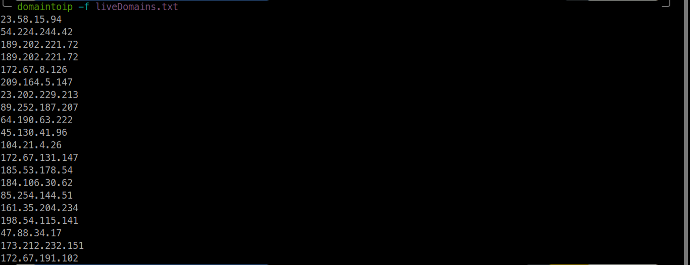

## Installation

```
cd /opt/
sudo git clone https://github.com/freelancermijan/domain-to-ip.git
cd domain-to-ip
sudo chmod +x domain-to-ip.py
cd
sudo ln -sf /opt/domain-to-ip/domain-to-ip.py /usr/local/bin/domaintoip
domaintoip -h
```


## Usage

### Single URL Mode

```
domaintoip -u "http://testphp.vulnweb.com"
```

#### Result

```
44.228.249.3
```

### File of hosts mode, just ip output

```
domaintoip -f Live_domains.txt
```

#### Result

```
44.228.249.3
44.228.249.3
44.228.249.3
44.228.249.3
44.228.249.3
44.228.249.3
44.228.249.3
44.228.249.3
44.228.249.3
44.228.249.3
44.228.249.3
```

### File of hosts Mode, domain with ip output

```
domaintoip -f Live_domains.txt -ds
```

#### Result

```
passport.vulnweb.com: 44.228.249.3
i5.vulnweb.com: 44.228.249.3
carmen.vulnweb.com: 44.228.249.3
lily.vulnweb.com: 44.228.249.3
images0.vulnweb.com: 44.228.249.3
tour.vulnweb.com: 44.228.249.3
www.photo.vulnweb.com: 44.228.249.3
opensource.vulnweb.com: 44.228.249.3
```
